# 🛡️ NCTIRS - National Cyber Threat Intelligence & Response System

<div align="center">


[](https://github.com/arapgechina24-lgtm/nctirs-platform-v2/actions/workflows/ci.yml)
[](https://github.com/arapgechina24-lgtm/nctirs-platform-v2/actions/workflows/codeql.yml)
[](https://github.com/arapgechina24-lgtm/nctirs-platform-v2/actions/workflows/scorecard.yml)
[](https://opensource.org/licenses/Apache-2.0)

**AI-Powered National Security & Smart Policing Intelligence Platform**

[Live Demo](https://nctirs-platform-v2.vercel.app) • [MAJESTIC SHIELD Proposal](./docs/MAJESTIC_SHIELD_PROPOSAL.md) • [Documentation](#-features) • [Getting Started](#-getting-started)

</div>

---

## 📋 MAJESTIC SHIELD Proposal

> **[Read the Full Unified Master Proposal](./docs/MAJESTIC_SHIELD_PROPOSAL.md)** - AI-Driven National Cyber-Intelligence & Zero-Trust Response System for Kenya's National Intelligence Service.

The proposal outlines:

- 🧠 **AI Threat Analytics Engine (ATAE)** - Deep Learning, NLP, Behavioral Biometrics
- 🏛️ **National Cyber Fusion Center (NCFC)** - Multi-agency intelligence integration
- 🔐 **Continuous Adaptive Authentication (CAA)** - Zero-Trust Architecture
- ⛓️ **Data Protection & Compliance Layer (DPCL)** - DPA 2019, Blockchain evidence

## 🎬 Demo

> **🚀 [Launch Live Demo](https://nctirs-platform-v2.vercel.app)** | Press `Ctrl+Shift+E` to trigger the Emergency Protocol simulation!


The platform simulates a Level 5 National Cyber Emergency with:

- 🔴 Cinematic "National Emergency" overlay with glitch effects
- 🔊 Voice narration using Web Speech API
- 📄 Real-time NC4 Compliance Report generation
- ✅ SHA-256 cryptographic audit trail

---

## 🚀 Features

### 🎯 Command Center

- **Real-time Threat Map**: Visualize active threats across Kenya's 47 counties
- **CNI Heatmap**: Monitor Critical National Infrastructure (SEACOM, KPLC, M-Pesa)
- **AI Threat Analytics**: MITRE ATT&CK framework integration with Google Gemini 2.0 Flash

### 🛡️ SOAR Automation

- **Automated Response Protocols**: One-click Air-Gap isolation
- **NC4 Compliance Reporting**: Aligned with Kenya Computer Misuse Act (2018)
- **SHA-256 Integrity Hashing**: Tamper-proof audit logs

### 📊 Compliance & Audit

- **National Audit Trail**: Immutable blockchain-backed log of all security actions
- **Partial Prerendering (PPR)**: Optimized performance with Next.js 16
- **KDPA 2019 Compliance**: Data protection indicators

### 🎭 Demo Mode

- **Auto-Trigger Simulation**: Watch the system respond to threats automatically
- **Keyboard Shortcuts**: `Ctrl+Shift+E` for Emergency, `Ctrl+Shift+A` for Audit

---

## 🛠️ Tech Stack

| Category | Technology |
| -------- | ---------- |
| Framework | Next.js 16 (App Router, PPR) |
| Language | TypeScript 5 |
| Styling | Tailwind CSS 4 |
| AI Engine | Google Gemini 2.0 Flash |
| Database | Turso (LibSQL) + Prisma ORM |
| Auth | NextAuth.js v5 (Credentials) |
| Real-time | Ably WebSockets |
| Maps | Leaflet + React-Leaflet |
| Charts | Recharts |
| Security | Node.js Crypto (SHA-256), bcrypt |

---

## �️ Architecture

```mermaid
flowchart TB
    subgraph Perception["🔍 Perception Layer"]
        IoT["IoT Sensors"]
        Drones["Drone Feeds"]
        NetSniff["Network Sniffers"]
        OSINT["OSINT Crawlers"]
    end

    subgraph Cognition["🧠 Cognition Layer"]
        Gemini["Google Gemini 2.0 Flash"]
        MITRE["MITRE ATT&CK Engine"]
        APT["APT Signature DB"]
        NLP["NLP Threat Classifier"]
    end

    subgraph Integrity["⛓️ Integrity Layer"]
        Blockchain["Blockchain Ledger"]
        SHA256["SHA-256 Hashing"]
        Audit["Immutable Audit Trail"]
        KDPA["KDPA 2019 Compliance"]
    end

    subgraph Response["🚨 SOAR Response"]
        AirGap["Air-Gap Isolation"]
        Dispatch["Police Dispatch"]
        NC4["NC4 Alert"]
        Block["IP Blocking"]
    end

    Perception --> Cognition
    Cognition --> Integrity
    Cognition --> Response
    Integrity --> Response
```



---

## 🏆 Why NCTIRS Wins

| # | Differentiator | Details |
| - | -------------- | ------- |
| 1 | **Real AI, Not Mockups** | Live Google Gemini 2.0 Flash integration — SENTINEL-OMEGA analyzes threats in real-time |
| 2 | **Production-Grade Stack** | Next.js 16, Prisma ORM, Turso DB, NextAuth v5, Ably WebSockets |
| 3 | **Kenya-First Design** | 47-county threat map, KPLC/M-Pesa/SEACOM CNI monitoring, DPA 2019 compliance |
| 4 | **Cinematic Demo** | Level 5 Emergency overlay with glitch effects, voice narration, and live audit trail |
| 5 | **Zero-Trust Architecture** | Continuous Adaptive Authentication with bcrypt + SHA-256 integrity hashing |
| 6 | **SOAR Automation** | One-click Air-Gap isolation, NC4 alerting, and automated police dispatch |
| 7 | **Full Compliance** | Computer Misuse Act (2018), KDPA 2019, and NIST SP 800-53 controls |
| 8 | **Enterprise Governance** | CI/CD, CodeQL, Scorecard, CODEOWNERS, signed commits, CITATION.cff |

---

## �🏁 Getting Started

```bash
# Clone the repository
git clone https://github.com/arapgechina24-lgtm/nctirs-platform-v2.git
cd nctirs-platform-v2

# Install dependencies
npm install

# Set up environment variables
cp .env.example .env.local
# Edit .env.local with your API keys (GEMINI_API_KEY, DATABASE_URL, AUTH_SECRET)

# Run development server
npm run dev

# Build for production
npm run build
```

Visit [http://localhost:3000](http://localhost:3000) to see the dashboard.

---

## ⌨️ Keyboard Shortcuts

| Shortcut | Action |
| -------- | ------ |
| `Ctrl+Shift+E` | Trigger Emergency Overlay |
| `Ctrl+Shift+A` | Open Audit Trail |
| `Ctrl+Shift+D` | Toggle Demo Mode |

---

## 📜 Legal Compliance

This system is designed to comply with:

- 🇰🇪 **Kenya Computer Misuse and Cybercrime Act (2018)** - Section 11: CII Protection
- 🇰🇪 **Kenya Data Protection Act (2019)** - PII exposure monitoring
- 🌍 **NIST SP 800-53** - Security controls framework

---

## 🧠 Real AI Integration (Gemini)

To enable real-time threat analysis powered by Google Gemini 2.0 Flash:

1. Get an API Key from [Google AI Studio](https://aistudio.google.com/).
2. Add it to your Vercel Project Settings:
    - Key: `GEMINI_API_KEY`
    - Value: `your-api-key-here`
3. Redeploy the application.

The AI operates as **SENTINEL-OMEGA**, an elite Director-Level Intelligence Fusion Engine providing CIA/FBI/Mossad-grade threat analysis with specific Kenyan operational context.

---

## ⚙️ Environment Variables

| Variable | Required | Description |
| -------- | -------- | ----------- |
| `GEMINI_API_KEY` | Yes | Google Gemini 2.0 Flash API key from [AI Studio](https://aistudio.google.com/) |
| `DATABASE_URL` | Yes | Turso (LibSQL) database connection URL |
| `AUTH_SECRET` | Yes | NextAuth.js v5 secret for session encryption |
| `ABLY_API_KEY` | Optional | Ably WebSocket key for real-time collaboration |
| `NEXTAUTH_URL` | Optional | Override for NextAuth callback URL (default: `http://localhost:3000`) |

---

## 🇰🇪 Built for Kenya

<div align="center">

**"Securing Kenya's Digital Backbone"**

This project was developed for the **NIRU Hackathon** to demonstrate how AI and automation can protect Kenya's Critical National Infrastructure from cyber threats.

*Built with ❤️ by Kenyan developers*

</div>

---

## 🗺️ Roadmap

| Phase | Feature | Status |
| ----- | ------- | ------ |
| ✅ v1.0 | Core Dashboard (5 Views) | Completed |
| ✅ v1.1 | Four Winning Pillars UI | Completed |
| ✅ v1.2 | Layout & Accessibility Improvements | Completed |
| ✅ v1.3 | Community Files & Documentation | Completed |
| ✅ v1.4 | Real-time WebSocket Integration (Ably) | Completed |
| ✅ v2.0 | Backend API & Authentication (NextAuth v5) | Completed |
| ✅ v2.1 | AI Intelligence Engine (Gemini 2.0 Flash) | Completed |
| ✅ v2.2 | SOAR Automation & Audit Compliance | Completed |
| 📋 v3.0 | Multi-agency Role-Based Access | Planned |
| 📋 v3.1 | Production Deployment Guides | Planned |

---

## 🤝 Contributing

We welcome contributions! Please see our community resources:

| Document | Description |
| -------- | ----------- |
| [CONTRIBUTING.md](CONTRIBUTING.md) | How to contribute to the project |
| [CODE_OF_CONDUCT.md](CODE_OF_CONDUCT.md) | Community standards and behavior |
| [SECURITY.md](SECURITY.md) | Security vulnerability reporting |
| [CHANGELOG.md](CHANGELOG.md) | Version history and changes |

### Quick Contribution Steps

1. Fork the repository
2. Create a feature branch (`git checkout -b feature/amazing-feature`)
3. Commit your changes (`git commit -m 'feat: add amazing feature'`)
4. Push to the branch (`git push origin feature/amazing-feature`)
5. Open a Pull Request

---

## 👥 Contributors

<a href="https://github.com/arapgechina24-lgtm/nctirs-platform-v2/graphs/contributors">
  
</a>

---

## 📄 License

Apache License 2.0 - See [LICENSE](LICENSE) for details.
