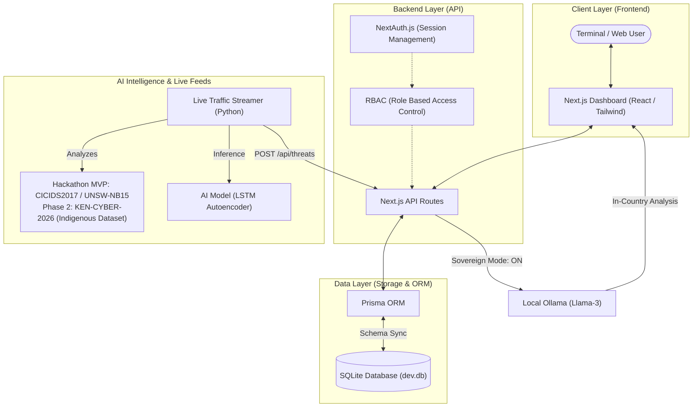

# NCTIRS Platform Architecture

This document outlines the high-level architecture of the National Cyber Threat Intelligence & Reporting System (NCTIRS) Platform.

## System Overview

The application follows a modern full-stack architecture using Next.js for both the frontend and proxy-backend API, integrated with a Python-based AI training and streaming service.

## Sovereign AI Tier (National Self-Reliance)

To comply with the **NIRU Hackathon Criteria A2 (National Self-Reliance)** and **D1 (Data Protection)**, the NCTIRS platform implements a dual-cognition architecture:

1. **PROTOTYPE LAYER (Foreign Cloud):** Utilizes Google Gemini 2.0 Flash for rapid iteration and high-throughput tactical synthesis during non-sensitive operations.
2. **SOVEREIGN LAYER (Local On-Prem):** A dedicated, air-gapped deployment path utilizing **Ollama** and **Llama-3 8B**.
   - **Data Egress:** 0% (No data leaves the internal secure network).
   - **Model Control:** Open-weight models are hosted on bare-metal servers, ensuring the system remains operational even if foreign API access is revoked.
   - **Legal Alignment:** Fully compliant with *Kenya Data Protection Act (2019)* regarding sensitive infrastructure data sovereignty.

## Core Components

### 1. Frontend (Next.js)

- **UI Framework**: React with Tailwind CSS for a premium, responsive dashboard.
- **State Management**: React Hooks and Context API.
- **Visuals**: Framer Motion for animations and Lucide-React for iconography.

### 2. Backend API

- **Route Handlers**: App Router-based API endpoints for Threats, Incidents, and AI Analytics.
- **Security**: NextAuth.js provides secure authentication.
- **Streaming Bypass**: A custom `x-stream-token` allows the Python streamer to securely push real-time threat data without manual session interaction.

### 3. Data Storage

- **ORM**: Prisma for type-safe database access.
- **Engine**: SQLite for local development and portability.

### 4. AI & Live Data

- **Anomaly Detection Models**: LSTM Autoencoders implemented in PyTorch for network anomaly detection.
- **Local LLM Strategy (Sector-Gapped Sovereign AI)**: While the Hackathon MVP utilizes Google Gemini 2.0 Flash for demonstration, the production rollout architecture mandates a **Sector-Gapped Sovereign AI**. This involves deploying locally hosted, open-weight models (like Llama-3 8B or Mistral) running on secure Kenyan government servers (e.g., Konza Technopolis) completely air-gapped from the public internet. This ensures National Self-Reliance (zero foreign API dependency) and strict Data Privacy compliance.
- **Indigenous Dataset Strategy (Phase 2)**: While the MVP utilizes CICIDS2017 for baseline anomaly detection, Phase 2 involves creating the first indigenous Kenyan Cyber Dataset by mirroring traffic from the National KE-CIRT to fine-tune the weights for local infrastructural anomalies (e.g., M-Pesa API abuse patterns, Safaricom/Airtel topologies).
- **Streaming**: A standalone Python service (`stream_live_traffic.py`) that simulates live network traffic, processes it through the AI models, and pushes detections to the dashboard in real-time.
