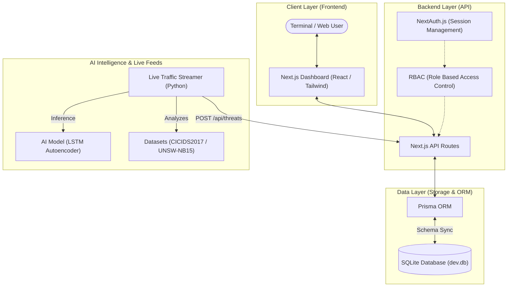

# NCTIRS Platform Architecture

This document outlines the high-level architecture of the National Cyber Threat Intelligence & Reporting System (NCTIRS) Platform.

## System Overview

The application follows a modern full-stack architecture using Next.js for both the frontend and proxy-backend API, integrated with a Python-based AI training and streaming service.

## Core Components

### 1. Frontend (Next.js)

- **UI Framework**: React with Tailwind CSS for a premium, responsive dashboard.
- **State Management**: React Hooks and Context API.
- **Visuals**: Framer Motion for animations and Lucide-React for iconography.

### 2. Backend API

- **Route Handlers**: App Router-based API endpoints for Threats, Incidents, and AI Analytics.
- **Security**: NextAuth.js provides secure authentication.
- **Streaming Bypass**: A custom `x-stream-token` allows the Python streamer to securely push real-time threat data without manual session interaction.

### 3. Data Storage

- **ORM**: Prisma for type-safe database access.
- **Engine**: SQLite for local development and portability.

### 4. AI & Live Data

- **Models**: LSTM Autoencoders implemented in PyTorch for network anomaly detection.
- **Streaming**: A standalone Python service (`stream_live_traffic.py`) that simulates live network traffic, processes it through the AI models, and pushes detections to the dashboard in real-time.
