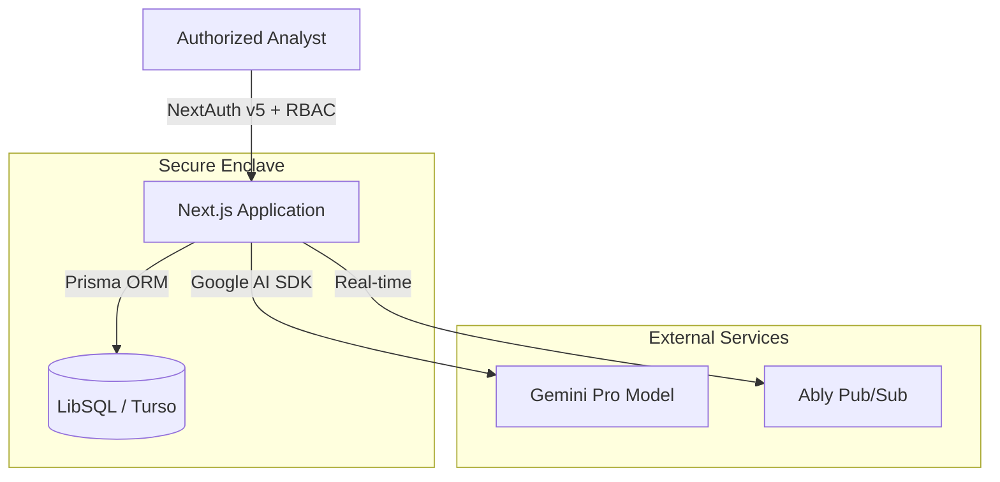

# System Architecture

## Overview

The NCTIRS Platform v2 is built on a **Zero-Trust Architecture** principle, ensuring secure data handling from edge sensors to central command.

## Core Components

### 1. Frontend (Next.js 15)

- **App Router**: Modern routing with server components.
- **Tailwind CSS**: Utility-first styling with dark mode support.
- **Lucide React**: Vector icons.

### 2. Backend (Server Actions + API Routes)

- **NextAuth.js v5**: Authentication & Session Management.
- **Zod**: Runtime schema validation.
- **Prisma**: Type-safe database access.

### 3. Intelligence Engine

- **TensorFlow.js**: Client-side anomaly detection (Autoencoder).
- **Gemini Pro**: Generative AI for threat analysis and classification.

## Data Flow

1. **Ingestion**: Telemetry data arrives via API or manual input.
2. **Validation**: Zod schemas enforce strict typing.
3. **Analysis**:
   - Rule-based filtering.
   - AI Classification (MITRE ATT&CK).
   - Anomaly Detection (Statistical + ML).
4. **Storage**: Encrypted storage in LibSQL.
5. **Response**: Automated alerts via Ably and Audit Logging.
